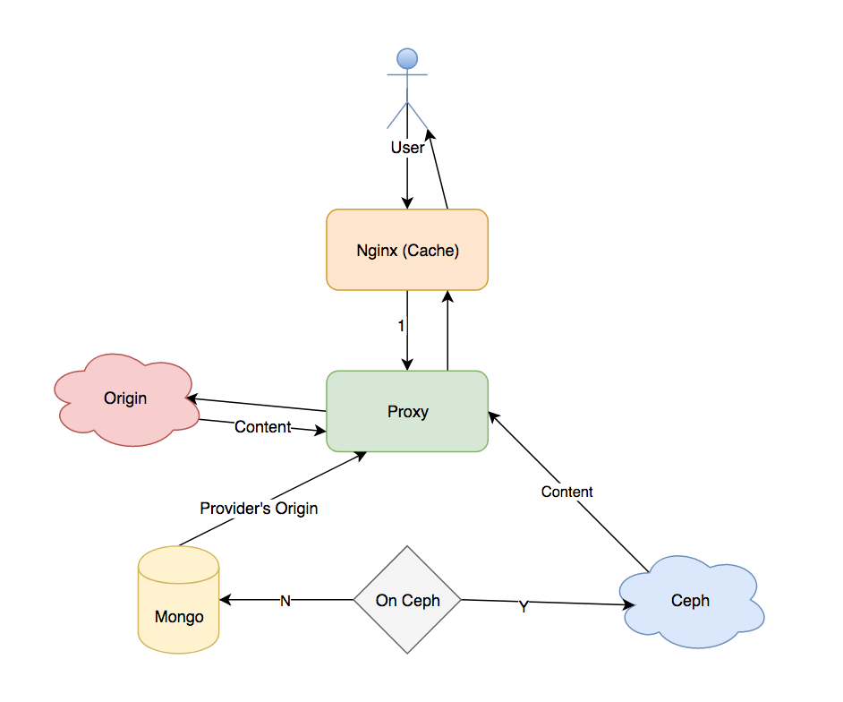

#### API document
https://app.swaggerhub.com/apis/elmeast1/CephStorage/1.0.2

#### Key Storage
1. bucket name: username + '_'*3 + bucketname
2. properties available to set:
	* content_type
	* md5 (integrity validating)
	* timetag (recording creating time)
3. key index data structure:
	
	```json
	{
		"key": KEYNAME(String),
		"ts": INT(Timestamp),
		"vfolder": PrefixingPath(String),
		"md5": MD5(String),
		"content_type":  ContentType(String),
		"size": SizeOfKey(Int)
	}
	```
4. Key Creating Progress Record:
	
	```json
	{
		"token": Token(String),
		"progress": State(String),
	}
	```
	
	State are in [inprogress, fail, success]
	
#### Configuration
1. cephutils/cephop.py handles ceph operation with boto. it requires:
	* access key of Ceph User
	* secret key of Ceph User
	* ceph rgw gateway address
	* An address used for publishing resource url.
   * download_path where temporarily downloaded content are stored
   * CephStorageIndex: Store key indexes.
   * CephStorageGeneral: General Info
   * CephStorageConfiguratoin: Config Info
   * CephStorageMonitor: Monitoring Data

#### Mirror
1. db: CephStorageGeneral.mirror
2. data structure:

```json
{
	"mirror_host": String [Unique]
	"bucket_name": String
	"real_host": String
}
```

#### Mirror Proxy
	
1. Nginx server cached content to user
2. Nginx ask Proxy for content not in Cache
3. Proxy ask Ceph for content and proxy back to nginx.
4. Proxy ask Provider's origin for content when Ceph doesn't have it
5. Proxy proxy back content from Provider's origin and upload to Ceph.


